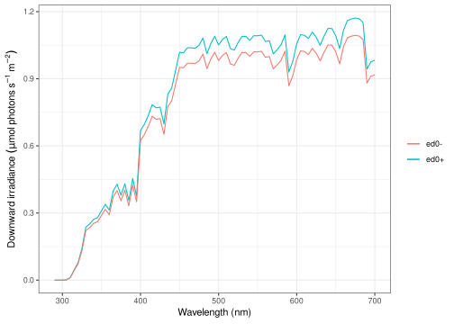

# ed0

<!-- badges: start --> [](https://cran.r-project.org/package=ed0)
[](http://www.gnu.org/licenses/gpl-2.0.html)
[](https://github.com/PMassicotte/ed0/actions)
<!-- badges: end -->

The goal of `ed0` is to compute in-air downward irradiance for the
pan-Arctic region. `ed0` uses a lookup table (LUT) generated using the
radiative transfer model SBDART (Santa Barbara DISORT Atmospheric
Radiative Transfer; [Ricchiazzi, Yang, Gautier, & Sowle,
1998](https://journals.ametsoc.org/doi/abs/10.1175/1520-0477%281998%29079%3C2101%3ASARATS%3E2.0.CO%3B2)).
The LUT and the original Fortran code to interpolate the values inside
the LUT have been produced by Dr. Simon Bélanger.

## Installation

The development version from GitHub can be installed with:

``` r
# install.packages("devtools")
devtools::install_github("pmassicotte/ed0")
```

## Example

``` r
library(tidyverse)
library(ed0)

df <- tibble(
  wavelength = seq(290, 700, by = 5),
  ed0p = ed0(
    yday = 100,
    hour = 12,
    lat = 67.47973,
    lon = -63.78953,
    tcl = 3,
    o3 = 330,
    cf = 1,
    albedo = 0.05,
    lut_type = "ed0+"
  ),
  ed0m = ed0(
    yday = 100,
    hour = 12,
    lat = 67.47973,
    lon = -63.78953,
    tcl = 3,
    o3 = 330,
    cf = 1,
    albedo = 0.05,
    lut_type = "ed0-"
  )
)

df
#> # A tibble: 83 x 3
#>    wavelength        ed0p        ed0m
#>         <dbl>       <dbl>       <dbl>
#>  1        290 0           0.000000200
#>  2        295 0.000000299 0.000000533
#>  3        300 0.0000449   0.0000422  
#>  4        305 0.00120     0.00112    
#>  5        310 0.0115      0.0107     
#>  6        315 0.0459      0.0429     
#>  7        320 0.0780      0.0728     
#>  8        325 0.141       0.132      
#>  9        330 0.237       0.221      
#> 10        335 0.252       0.235      
#> # … with 73 more rows

df %>%
  ggplot(aes(x = wavelength)) +
  geom_line(aes(y = ed0p, color = "ed0+")) +
  geom_line(aes(y = ed0m, color = "ed0-")) +
  theme_bw() +
  xlab("Wavelength (nm)") +
  ylab(bquote(Downward ~ irradiance ~ (mu * mol ~ photons ~ s^{-1} ~ m^{-2}))) +
  theme(legend.title = element_blank())
```



``` r
df <- tibble(
  date_time_utc = seq(
    from = as.POSIXct("2018-07-01 0:00", tz = "UTC"),
    to = as.POSIXct("2018-07-03 23:00", tz = "UTC"),
    by = "hour"
  ),
  hour = lubridate::hour(date_time_utc),
  yday = lubridate::yday(date_time_utc),
  lat = 45.5017, # Montreal coordinates
  lon = -73.5673,
  tcl = 3,
  o3 = 330,
  cf = 0.2,
  albedo = 0.05
) %>%
  mutate(par = edpar(
    yday,
    hour,
    lat,
    lon,
    tcl,
    o3,
    cf,
    albedo,
    lut_type = "ed0+"
  ))

# Do not forget that time is in UTC format. Let's format it back to local time.

df %>% 
  mutate(date_time_local = date_time_utc - lubridate::hours(4)) %>%   
  ggplot(aes(x = date_time_local, y = par)) +
  geom_line() +
  scale_x_datetime(date_breaks = "12 hours") +
  theme_bw() +
  xlab(NULL) +
  ylab(bquote(PAR ~ (mu * mol ~ photons ~ s^{-1} ~ m^{-2}))) +
  theme(axis.text.x = element_text(angle = 30, hjust = 1))
```


## Code of conduct

Please note that the ‘ed0’ project is released with a [Contributor Code
of Conduct](CODE_OF_CONDUCT.md). By contributing to this project, you
agree to abide by its terms.
